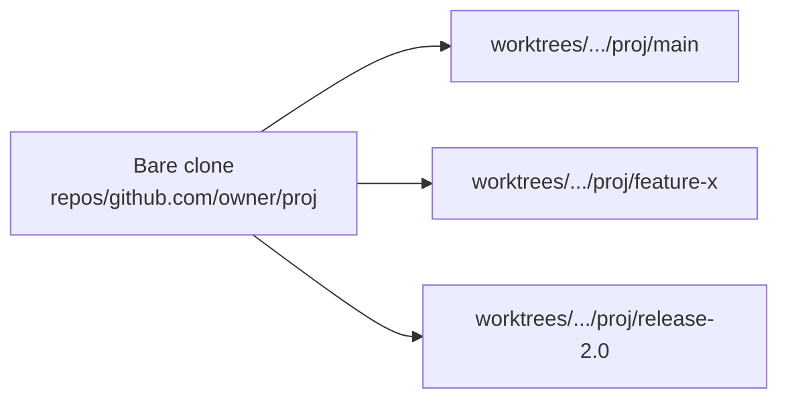

Makework is a single Go module with internal packages and a small set of files
on disk. Knowing the layout helps you debug, contribute, or extend it.

## Module layout

```
Makework/
├── cmd/mw/           # binary entry point
├── internal/
│   ├── cli/          # Cobra CLI definitions and dispatch
│   ├── config/       # config.toml loading and management
│   ├── catalog/      # repo registry, sync, add, resolution
│   ├── resolver/     # weighted fuzzy project resolution
│   ├── worktree/     # git worktree path computation, creation, listing
│   ├── repo/         # git shell-out wrappers and URL parsing
│   ├── nix/          # nix environment detection
│   ├── project/      # per-project .makework.toml schema
│   ├── status/       # worktree status and caching
│   ├── search/       # grep across worktrees
│   ├── query/        # git log activity queries
│   ├── template/     # template file application
│   ├── maintenance/  # git maintenance registration
│   ├── xdgpath/      # XDG directory resolution
│   └── buildinfo/    # version info via ldflags
├── editors/emacs/    # makework.el integration package
└── docs/             # Mintlify documentation site
```

All logic lives in `internal/` packages. `cmd/mw` is a trivial main that calls
`cli.Execute()`. The Claude Code skill (`mw ai init`) replaces the former MCP
server for AI assistant integration.

## Data on disk

| Path                                              | Contents                                          |
|---------------------------------------------------|---------------------------------------------------|
| `$XDG_CONFIG_HOME/makework/config.toml`           | Global settings (paths, scan roots, weights)      |
| `$XDG_CONFIG_HOME/makework/catalog.toml`          | Registered repositories and projects              |
| `$XDG_DATA_HOME/makework/repos/<host>/<owner>/<name>` | Bare clones (`bare_root`)                  |
| `$XDG_DATA_HOME/makework/worktrees/<host>/<owner>/<name>/<branch>` | Worktrees (`worktree_root`)        |
| `$XDG_STATE_HOME/makework/visits.json`            | Frecency database for the resolver                |
| `$XDG_STATE_HOME/makework/repo-roots.txt`         | Cached list of repo paths for the shell hook      |
| `$XDG_STATE_HOME/makework/cache/`                 | Per-repo status snapshots (branch, dirty, ahead/behind) |
| `<repo>/.makework.toml`                           | Per-project overrides committed to the repo       |

The `$XDG_*` variables follow the
[Base Directory Specification](https://specifications.freedesktop.org/basedir-spec/basedir-spec-latest.html).
On macOS without `XDG_*` set, Makework falls back to `~/.local/...`.

## The bare-clone + worktree split

Most git tooling assumes one clone, one working tree. That breaks when you
want to keep three branches checked out simultaneously: switching one moves
the others out from under your editor and build artifacts.

Makework instead uses git's
[`worktree`](https://git-scm.com/docs/git-worktree) feature. Each repository
is cloned **once** as a bare repository, then each branch you check out becomes
its own working directory pointing back at that bare clone.



This means:

- Switching branches is `cd`, not `git checkout`. No stash, no rebuild.
- Each worktree has its own untracked files, build cache, and editor session.
- Disk usage scales with the number of branches, but only the working tree
  itself is duplicated — the object store stays in the bare clone.

## Where each command lives

| Subcommand              | Package                  |
|-------------------------|--------------------------|
| `go`, `new`, `rm`, `ls` | `internal/worktree`     |
| `catalog *`, `sync`     | `internal/catalog`      |
| `config *`              | `internal/config`       |
| `fetch`                 | `internal/repo`         |
| `search`                | `internal/search`       |
| `query`                 | `internal/query`        |
| `project *`             | `internal/project`      |
| `maintenance *`         | `internal/maintenance`  |
| `resolver explain`      | `internal/resolver`     |
| `ai init`               | `internal/cli`          |
