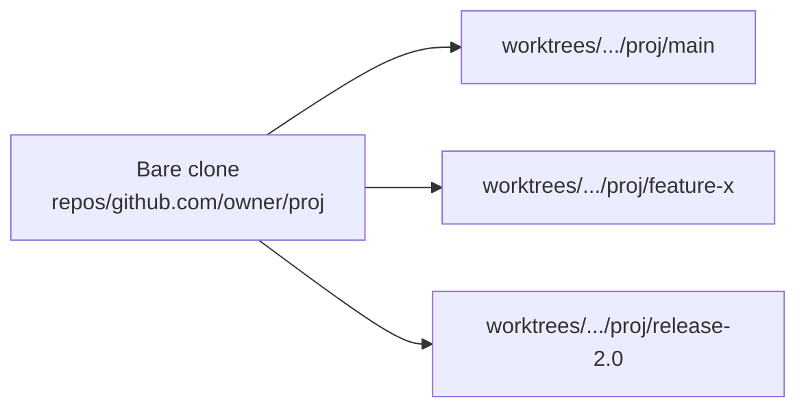

Makework is a Cargo workspace with three crates and a small set of files on
disk. Knowing the layout helps you debug, contribute, or extend it.

## Workspace layout

```
Makework/
├── crates/
│   ├── mw-core/   # library: catalog, worktree, resolver, nix detection, ...
│   ├── mw-cli/    # binary: mw — clap dispatch, output formatting
│   └── mw-mcp/    # binary feature: Model Context Protocol server
├── editors/emacs/ # makework.el integration package
└── docs/          # Mintlify documentation site
```

`mw-core` holds all logic and is the only crate with non-trivial code. `mw-cli`
is a thin clap dispatcher; `mw-mcp` exposes the same operations over JSON-RPC.

## Data on disk

| Path                                              | Contents                                          |
|---------------------------------------------------|---------------------------------------------------|
| `$XDG_CONFIG_HOME/makework/config.toml`           | Global settings (paths, scan roots, weights)      |
| `$XDG_CONFIG_HOME/makework/catalog.toml`          | Registered repositories and projects              |
| `$XDG_DATA_HOME/makework/repos/<host>/<owner>/<name>` | Bare clones (`bare_root`)                  |
| `$XDG_DATA_HOME/makework/worktrees/<host>/<owner>/<name>/<branch>` | Worktrees (`worktree_root`)        |
| `$XDG_STATE_HOME/makework/visits.json`            | Frecency database for the resolver                |
| `$XDG_STATE_HOME/makework/repo-roots.txt`         | Cached list of repo paths for the shell hook      |
| `$XDG_STATE_HOME/makework/cache/`                 | Per-repo status snapshots (branch, dirty, ahead/behind) |
| `<repo>/.makework.toml`                           | Per-project overrides committed to the repo       |

The `$XDG_*` variables follow the
[Base Directory Specification](https://specifications.freedesktop.org/basedir-spec/basedir-spec-latest.html).
On macOS without `XDG_*` set, Makework falls back to `~/.local/...`.

## The bare-clone + worktree split

Most git tooling assumes one clone, one working tree. That breaks when you
want to keep three branches checked out simultaneously: switching one moves
the others out from under your editor and build artifacts.

Makework instead uses git's
[`worktree`](https://git-scm.com/docs/git-worktree) feature. Each repository
is cloned **once** as a bare repository, then each branch you check out becomes
its own working directory pointing back at that bare clone.



This means:

- Switching branches is `cd`, not `git checkout`. No stash, no rebuild.
- Each worktree has its own untracked files, build cache, and editor session.
- Disk usage scales with the number of branches, but only the working tree
  itself is duplicated — the object store stays in the bare clone.

## Where each command lives

| Subcommand           | Module                              |
|----------------------|-------------------------------------|
| `go`, `new`, `rm`, `ls` | `mw-core::worktree`              |
| `catalog *`, `sync`  | `mw-core::catalog`                  |
| `config *`           | `mw-core::config`                   |
| `fetch`              | `mw-core::repository`               |
| `search` (alias `grep`) | `mw-core::search`                |
| `query`              | `mw-core::query`                    |
| `project *`          | `mw-core::project`                  |
| `maintenance *`      | `mw-core::maintenance`              |
| `resolver explain`   | `mw-core::resolver`                 |
| `mcp`                | `mw-mcp::server`                    |
